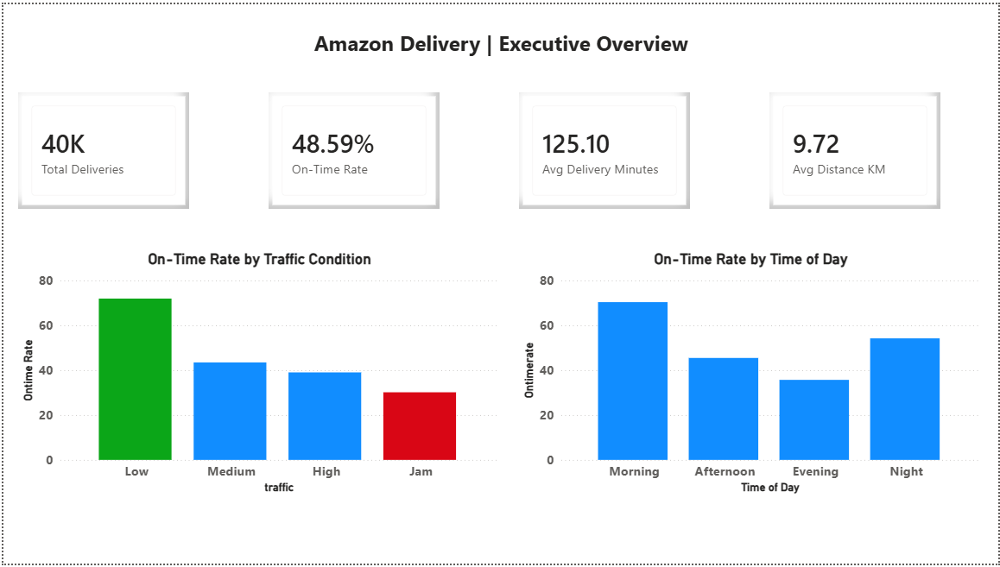
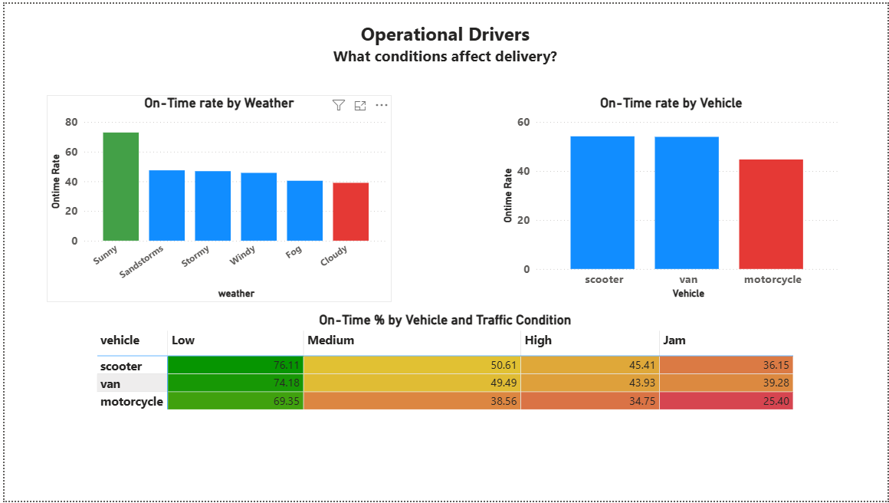
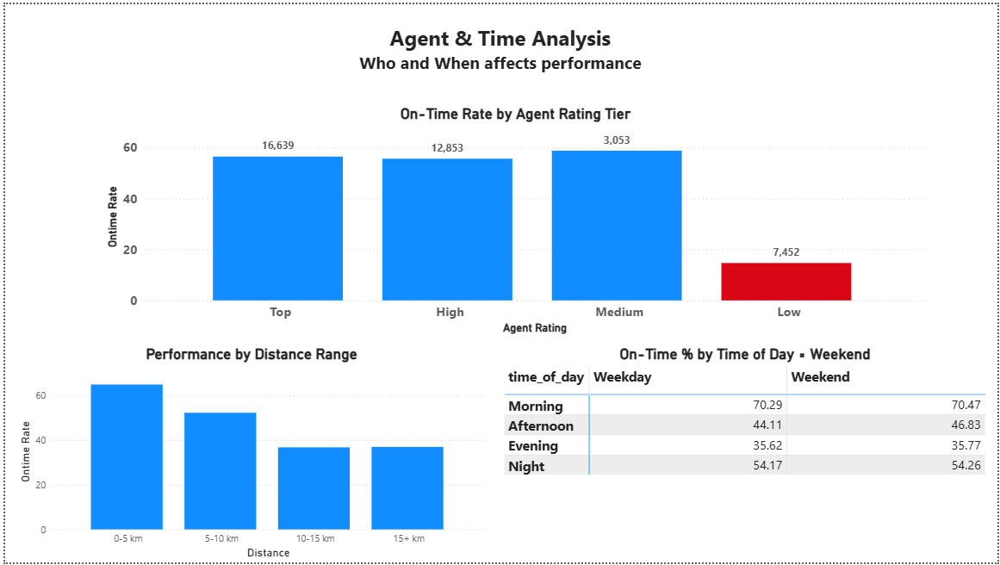

# Amazon Delivery | India Last-Mile Logistics Performance Analysis


End-to-end SQL and Power BI analysis of 43,739 Amazon delivery records from India — investigating which operational levers drive on-time performance in last-mile logistics. Combines feature engineering, geospatial calculations, and multi-dimensional analysis to identify the cliff effects, breakpoints, and counterintuitive patterns hidden in raw delivery data.

---

## 📊 Dashboard Preview

The dashboard consists of three pages, each focused on a distinct analytical lens.

---

### Page 1 — Executive Overview
*Top-line KPIs, on-time rate by traffic condition, and on-time pattern by time of day.*



---

### Page 2 — Operational Drivers
*What conditions affect delivery performance: weather, vehicle type, and the multi-dimensional Vehicle × Traffic heatmap that proves motorcycles underperform across ALL traffic conditions, not just because they handle higher volume.*



---

### Page 3 — Agent & Time Analysis
*Headline insight: a sharp threshold effect in agent ratings. Top, High, and Medium tier agents all perform similarly (~56% on-time), but Low-tier agents collapse to 15% — the strongest single predictor of operational failure in the dataset.*



---

## 🎯 Project Overview

This project analyzes 43,739 Amazon delivery records from Indian cities, covering urban and metropolitan last-mile fulfillment across multiple vehicle types, traffic conditions, and weather scenarios. The goal was to build a complete analytical pipeline from raw transactional data to executive-ready insights, with a focus on **feature engineering and geospatial analysis** within a single-table dataset.

The work is structured around a central business question:

> **What operational and environmental factors most strongly drive on-time delivery performance, and where are the structural breakpoints in the operation?**

The analysis combines aggressive data cleaning (cross-midnight handling, coordinate outlier detection), Haversine distance calculation in pure SQL, and 10 engineered features feeding a 3-page Power BI dashboard.

This is a complementary portfolio piece to [`olist-brazilian-ecommerce-analysis`](https://github.com/mosalahshawky/olist-brazilian-ecommerce-analysis): where Olist demonstrates multi-table relational JOINs and view layering, this project demonstrates **single-table depth** — feature engineering, mathematical calculations in SQL, and threshold validation through distribution analysis.

---

## 🛠 Tech Stack

| Tool | Purpose |
|------|---------|
| **MySQL 8.0** | Database for storing, cleaning, and modeling the dataset |
| **MySQL Workbench** | SQL development and query testing environment |
| **Power BI Desktop** | Dashboard development with DAX measures |
| **Git / GitHub** | Version control and project publishing |

**Key SQL techniques applied:** window functions (`RANK() OVER PARTITION BY`), conditional aggregation (`SUM(CASE WHEN)`), Haversine formula implementation in pure SQL (`RADIANS`, `SIN`, `COS`, `ASIN`, `SQRT`), subqueries for HAVING-style filtering on calculated columns, date arithmetic with `TIMESTAMPDIFF` and `DATE_ADD`, cross-midnight DATETIME construction with conditional logic, layered view architecture (medallion pattern), only_full_group_by-compliant aggregations.

**Key DAX measures built:** Total Deliveries, On-Time Rate, Avg Delivery Minutes, Avg Distance, with conditional formatting rules driving the green/red color encoding throughout the dashboard.

---

## 📂 Dataset

**Source:** [Amazon Delivery Dataset](https://www.kaggle.com/datasets/sujalsuthar/amazon-delivery-dataset) (Kaggle, by sujalsuthar)

**Geographic scope:** India (multiple cities including Bangalore, Indore, Hyderabad, Chennai, Mumbai)

**Volume:** 43,739 delivery records, 16 columns

**Schema overview:** A single flat table with order, agent, store/drop coordinates, weather and traffic conditions, vehicle type, area type, delivery time in minutes, and product category. Unlike a multi-table relational dataset, the complexity lives in feature engineering — building meaningful business-level metrics from raw operational fields.

**Key data quality findings during cleaning:**
- **91 rows** with `'NaN'` placeholder strings in Order_Time, Weather, and Traffic — same 91 rows across all three columns, indicating systematically incomplete records (excluded from analysis)
- **Trailing whitespace** in categorical columns (`"motorcycle "`, `"Urban "`) — a silent bug that would have produced inflated GROUP BY category counts
- **Date format mismatch** — source CSV uses DD/MM/YYYY but MySQL expects YYYY-MM-DD (converted via `STR_TO_DATE`)
- **3,505 rows with coordinates at "Null Island" (0, 0)** — missing GPS data placeholders (excluded from geographic analysis)
- **156 distance outliers** — Haversine calculation revealed deliveries exceeding 500km, clearly coordinate errors for last-mile delivery (excluded via 50km threshold; distance distribution split cleanly between ~40k legitimate deliveries under 30km and exactly 156 errors)
- **828 cross-midnight pickup cases** — orders placed at 23:xx with pickups at 00:xx the next day, initially appearing as "pickup before order" anomalies (resolved by building proper DATETIME columns with conditional date adjustment)

---

## 📁 Project Structure

    Delivery-Performance-Logistics-Analysis/
    ├── README.md
    ├── images/
    │   ├── page1_overview.png
    │   ├── page2_operational.png
    │   └── page3_agent_time.png
    ├── sql/
    │   ├── 01_setup_and_import.sql      # CREATE TABLE, LOAD DATA, types
    │   ├── 02_data_cleaning.sql          # NaN cleanup, dates, datetime
    │   ├── 03_features_and_geo.sql       # Haversine + feature view
    │   └── 04_analysis_views.sql         # 10 analytical views
    ├── powerbi/
    │   └── amazon_delivery_dashboard.pbix
    └── data/
        ├── amazon_delivery_Raw.csv
        └── amazon_delivery_Cleaned.csv

---

## 🔍 Methodology

The project followed a five-phase pipeline. Each phase produced concrete artifacts (cleaned data, views, dashboard) that the next phase built on.

---

### Phase 1 — Data Preparation

The source CSV (43,739 rows × 16 columns) was loaded into MySQL using `LOAD DATA LOCAL INFILE` for fast bulk import. Initial column types were intentionally conservative:

- **Dates and times loaded as `VARCHAR` first** because the source DD/MM/YYYY format cannot be parsed by MySQL directly — converted to proper `DATE` and `TIME` types after format fixes
- **Coordinates use `DOUBLE`** for adequate precision (FLOAT loses accuracy beyond ~6 decimal places, which matters for GPS data)
- **`Order_ID` as `VARCHAR(50)`** rather than INT — they are random hash strings, never used in math

---

### Phase 2 — Data Cleaning & Validation

Rather than blindly trust the data, a systematic audit was performed before any cleanup:

**NULL and NaN audit** — Quantified each data quality issue before fixing. Discovered that 91 rows had `'NaN'` placeholder strings consistently across Order_Time, Weather, and Traffic — the same 91 incomplete records, all clustered together. Converted these to true NULL using `TRIM()` + UPDATE pattern.

**Whitespace audit** — Categorical columns contained trailing spaces (`"motorcycle "`, `"Urban "`, `"Pet Supplies "`). Applied `TRIM()` UPDATEs to all categorical columns. Without this fix, GROUP BY would have treated `"motorcycle"` and `"motorcycle "` as separate categories.

**Date format conversion** — Source dates in DD/MM/YYYY format were reformatted via `STR_TO_DATE()` with the `WHERE column LIKE '%/%'` clause for idempotency (safe to re-run without breaking), then column type altered to `DATE`.

**Cross-midnight pickup handling** — Initial timing analysis flagged 828 rows where `pickup_time < order_time`. Investigation showed all 828 fit a single pattern: orders placed at HOUR=23 with pickups at HOUR≤1 the next day. Built proper `DATETIME` columns using `TIMESTAMP()` with conditional logic:

```sql
SET pickup_datetime = 
    CASE 
        WHEN pickup_time >= order_time 
            THEN TIMESTAMP(order_date, pickup_time)
        ELSE TIMESTAMP(DATE_ADD(order_date, INTERVAL 1 DAY), pickup_time)
    END
```

Post-fix verification confirmed zero rows had pickup before order.

**Cleaning view** — `deliveries_clean` excludes the 91 incomplete records and includes the constructed DATETIME columns. Defensive multi-column WHERE clause ensures robustness if future data updates introduce different NULL patterns.

---

### Phase 3 — Geospatial Cleaning and Feature Engineering

**Haversine distance calculation in pure SQL.** The store-to-drop distance was calculated using the great-circle formula:

```sql
6371 * 2 * ASIN(SQRT(
    POWER(SIN(RADIANS(drop_latitude - store_latitude) / 2), 2) +
    COS(RADIANS(store_latitude)) * COS(RADIANS(drop_latitude)) *
    POWER(SIN(RADIANS(drop_longitude - store_longitude) / 2), 2)
))
```

**Coordinate outlier detection.** Distance calculations exposed two data quality issues invisible in raw coordinates:

1. **Null Island rows** — 3,505 records with coordinates near (0, 0), the classic GPS-failure placeholder. These produce nonsense distances (e.g., Indore to Atlantic Ocean = ~5,500km).
2. **Distance outliers** — Calculated distances split cleanly into two populations: ~40,000 deliveries under 30 km averaging 9.7 km (sensible urban last-mile distances), and exactly 156 rows beyond 500 km (clearly coordinate errors). The clean separation made the 50 km threshold both defensible and uncontroversial.

The geo-cleaned view excludes both classes, retaining ~39,997 deliveries with valid geographic data.

**Threshold validation through distribution analysis.** The initial on-time threshold of 30 minutes (based on industry quick-commerce benchmarks) classified 96% of deliveries as late — clearly miscalibrated. Distribution analysis revealed:
- Min delivery time: 10 minutes
- Max: 270 minutes (4.5 hours)
- Average: ~125 minutes
- This is **B2C parcel delivery**, not quick-commerce

Recalibrated to 120 minutes, producing a balanced ~49/51 on-time vs late split with operational meaning. Documented the recalibration reasoning in code comments.

**Ten engineered features** were added on top of the geo-cleaned data:

| Feature | Definition |
|---|---|
| `is_on_time` | 1 if delivery_time ≤ 120 min, else 0 |
| `delivery_speed_bucket` | Fast / Normal / Slow / Very Slow |
| `pickup_delay_min` | Minutes between order and pickup |
| `time_of_day` | Morning / Afternoon / Evening / Night |
| `day_of_week` | Monday, Tuesday, etc. |
| `is_weekend` | 1 if Saturday/Sunday |
| `agent_age_group` | 18-24 / 25-34 / 35-44 |
| `agent_rating_tier` | Top / High / Medium / Low (data-driven thresholds) |
| `distance_km` | Haversine great-circle distance |
| `delivery_speed_kmh` | distance_km ÷ (delivery_time ÷ 60) |

Each bucket boundary was validated against the actual data distribution to avoid creating buckets that lumped 95% of data into a single category.

---

### Phase 4 — Analytical Views

Ten analytical views were built to answer specific business questions, each purpose-built for a Power BI visual. Several include sort-helper columns (`traffic_order`, `tier_order`, `time_order`, `distance_order`) that Power BI uses with "Sort by column" to display categorical values in business-meaningful order rather than alphabetical.

A subtle issue was handled in `analysis_distance_vs_time`: MySQL's strict `only_full_group_by` mode rejected an initial query because the SELECT included two derived columns (`distance_order` and `distance_bucket`) both calculated from the base `distance_km`. The fix was to include the full CASE expressions in GROUP BY, making the columns deterministic from the GROUP BY clause.

The `analysis_speed_by_vehicle_traffic` view produces a 3×4 matrix (vehicle × traffic) that became the Page 2 centerpiece of the dashboard. With conditional formatting applied as a heatmap, the matrix instantly reveals that motorcycles rank worst in every traffic condition — proving the vehicle weakness is intrinsic, not a routing artifact.

---

### Phase 5 — Power BI Dashboard

The dashboard was built as a 3-page narrative with consistent visual language across pages:

- **Page 1 (Executive Overview)** — top-line KPIs and the high-level traffic and time-of-day patterns
- **Page 2 (Operational Drivers)** — weather, vehicle, and the multi-dimensional heatmap
- **Page 3 (Agent & Time Analysis)** — the agent rating cliff (the headline insight), distance breakpoint, and time-of-day matrix

A dedicated `_Measures` table holds DAX measures separated from the data tables. The `On-Time Rate` measure required dividing by 100 then applying percentage format (since the underlying view stores percentages as 48.59 rather than 0.4859) — a common DAX gotcha.

Color encoding was applied consistently across all pages: green for best performance (Low traffic, Sunny weather, Top tier), red for worst (Jam, Cloudy, Motorcycle, Low tier), blue as neutral. This creates a unified visual language where viewers instantly understand the operational story without reading axis labels.

---

## 💡 Key Insights

### 1. Agent rating shows a sharp cliff at "Low" tier — the strongest single predictor

Top, High, and Medium tier agents all perform similarly (**~56% on-time, ~116 min avg**). But the **Low-tier collapses to 15% on-time and 166 min avg** — nearly 4× worse. The Low tier represents 7,452 deliveries (~19% of volume), large enough that reassigning these agents would yield more operational improvement than any other single lever in the dataset.

### 2. Motorcycles underperform across ALL traffic conditions

The Vehicle × Traffic matrix proves the motorcycle disadvantage is **intrinsic to the vehicle**, not a routing artifact. Even in Low-traffic conditions where all vehicles perform best, motorcycles trail scooters by 7 percentage points. The gap holds in Medium (-12pp), High (-10pp), and Jam (-11pp) traffic. Motorcycles handle 59% of total volume but never rank first in any traffic condition.

### 3. Traffic is the biggest environmental driver — 42pp gap from Low to Jam

On-time rate drops from **72% in Low traffic to 30% in Jam**, with corresponding avg delivery time increasing from 101 to 148 minutes. No other single variable in the dataset produces this magnitude of swing.

### 4. The 10 km operational breakpoint

Distance bucket analysis revealed a clear operational threshold: on-time rates of 52-65% under 10 km collapse to **37% beyond 10 km**, and stay flat thereafter. Effective delivery speed simultaneously increases with distance (longer trips spend less time on per-delivery overhead), but this efficiency doesn't translate into hitting the 120-minute commitment window.

### 5. Evening capacity-vs-demand mismatch

**41% of all orders occur in the Evening (17:00–20:59), but on-time rates collapse to 36% during this window**. Morning deliveries achieve 70% on-time on similar volume distribution. Operations capacity is dramatically misaligned with demand patterns.

### 6. Cloudy weather is the worst, not Stormy

Counterintuitive finding: Cloudy weather produces 39% on-time vs Stormy (47%) and Sandstorms (47%). Possibly reflects pre-rain road conditions where drivers haven't adjusted to wet surfaces, or an early-monsoon proxy. Sunny weather leads at 73%.

### 7. Weekend vs weekday shows no meaningful difference

Time-of-day × weekend analysis revealed essentially identical performance between Weekday and Weekend at every time bucket (within ~1 percentage point). Day-of-week is not a useful dimension for capacity planning in this operation — documenting a "non-finding" is itself a finding.

---

## 🎓 Skills Demonstrated

### SQL (MySQL)
- Layered view architecture (medallion pattern: raw → clean → geo → features)
- **Haversine formula implementation** in pure SQL (trigonometric functions)
- Conditional DATETIME construction for cross-midnight scenarios
- Aggregations: `SUM`, `COUNT`, `COUNT DISTINCT`, `AVG`, `ROUND`
- Window functions: `RANK() OVER (PARTITION BY ... ORDER BY ...)`
- Conditional aggregation: `SUM(CASE WHEN ... THEN 1 ELSE 0 END)`, `AVG(CASE WHEN ...)`
- Subqueries for HAVING-style filtering on calculated columns
- Date arithmetic: `TIMESTAMPDIFF`, `DATE_ADD`, `DATE_FORMAT`, `DAYOFWEEK`, `DAYNAME`, `HOUR`
- Bulk loading: `LOAD DATA LOCAL INFILE` with format conversion
- Idempotent UPDATE patterns (using WHERE clauses that prevent re-running breakage)
- only_full_group_by compliance via repeated GROUP BY expressions

### Power BI / DAX
- Multi-page dashboard design with consistent visual language
- Dedicated `_Measures` table architecture
- DAX measures: `SELECTEDVALUE`, `SUM`, `AVERAGE`, conditional formatting expressions
- Conditional formatting: rules-based color encoding (green/red/blue palette)
- Heatmap matrix construction with gradient cell-level formatting
- "Sort by column" feature using SQL-side sort-helper columns
- Visual-level filtering and axis sort customization

### Analytical Thinking
- **Distribution-based threshold validation** (initial 30-min on-time threshold rejected after finding 96% would be classified late; recalibrated to 120 min)
- **Outlier detection through derived calculations** (Haversine exposed 156 coordinate errors invisible in raw lat/lng)
- **Cross-validation between dimensions** (Vehicle × Traffic matrix to test routing vs intrinsic vehicle hypothesis)
- **Documentation of non-findings** (weekend vs weekday similarity treated as a finding worth recording)
- **Threshold cliff detection** (recognizing Top/High/Medium tiers cluster together while Low collapses — not a gradient)
- Decision documentation: justifying inclusions, exclusions, threshold choices

### Tools & Workflow
- MySQL Workbench: schema design, query authoring, debugging
- Power BI Desktop: data modeling, DAX, report design
- Git / GitHub: portfolio publishing, structured repository organization

---

## 🚀 How to Reproduce

### Prerequisites
- MySQL 8.0+ and MySQL Workbench installed
- Power BI Desktop installed (Windows)
- MySQL Connector/NET (required for Power BI to connect to MySQL)

### Step 1 — Download the dataset
Download `amazon_delivery_Raw.csv` from the [Kaggle dataset](https://www.kaggle.com/datasets/sujalsuthar/amazon-delivery-dataset) and save it locally. A copy is also included in this repo's `data/` folder.

### Step 2 — Prepare MySQL for local file imports
Enable `LOAD DATA LOCAL INFILE` on both server and client side. In Workbench, also configure the connection: **Edit Connection → Advanced → Others** → add `OPT_LOCAL_INFILE=1`.

### Step 3 — Run the SQL files in order
Adjust the file path in `01_setup_and_import.sql` to match where you saved the CSV.

1. `sql/01_setup_and_import.sql` — Creates database, table, and imports data
2. `sql/02_data_cleaning.sql` — NaN cleanup, datetime construction, cleaning view
3. `sql/03_features_and_geo.sql` — Haversine distance and feature engineering
4. `sql/04_analysis_views.sql` — 10 analytical views

### Step 4 — Open the Power BI dashboard
Open `powerbi/amazon_delivery_dashboard.pbix`. Update the MySQL connection credentials when prompted.

### Step 5 — Refresh and explore
Click **Refresh** in Power BI Desktop to pull data from your local MySQL views.

---

## 👋 About Me

This is a portfolio project in my transition from finance and accounting (10+ years at the British Council and other firms) into data analytics. Other portfolio projects available in my [GitHub profile](https://github.com/mosalahshawky), including the complementary [`olist-brazilian-ecommerce-analysis`](https://github.com/mosalahshawky/olist-brazilian-ecommerce-analysis) which demonstrates multi-table relational analysis.

Currently based in Magdeburg, Germany, pursuing a Master's in Entrepreneurship & Innovation Management and seeking junior data analyst opportunities.

📧 **Contact:** mosalahshawky@gmail.com
💼 **LinkedIn:** [linkedin.com/in/mohamed-s-shawky](https://www.linkedin.com/in/mohamed-s-shawky/)
🌐 **Portfolio:** [github.com/mosalahshawky](https://github.com/mosalahshawky)
